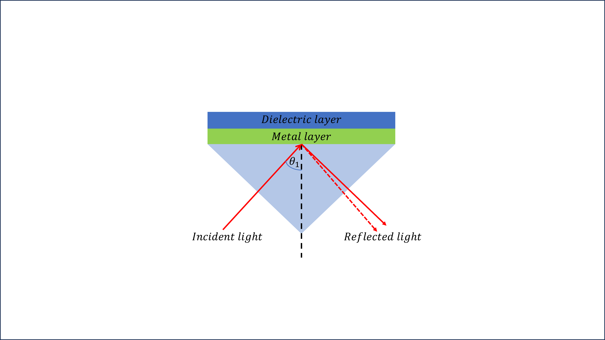

# Data Scientist
Technical Skills: Python, MATLAB

### Education
- Ph.D., Physics | Kasetsart University (_2022_)
- M.S., Physics | Kasetsart University (_2015_)
- B.S., Physics | Kasetsart University (_2012_)

### Work Experience
**Assistant Researcher**
- Developed a research plan, designed an experimental setup, and conducted data collection and analysis for the Nam Dok Mai Si Thong mango grading machine project.
- Developed a **Python** program that utilizes biochemical quantitative data to cluster the maturity level of Nam Dok Mai Si Thong mangoes to label ripeness stages into unripe, ripe, and overripe classes.
- Developed a program in **Python** for nondestructive detection, accurately classifying the maturity level of Nam Dok Mai Si Thong mangoes with a mean accuracy of 89.6% for unripe, ripe, and overripe classes.
- Showcased the project at the National Research Expo 2019 held at the Centara Grand Hotel and Bangkok Convention Center, Central World, Bangkok.
- Preparation and publish articles “Automatic Classification of the Ripeness Stage of Mango Fruit Using a Machine Learning Approach.” (Cited by 11) 
-	Developed a program in **MATLAB** that utilized a genetic algorithm optimization technique to optimize the thickness of thin films for metal nitride-coupled plasmon waveguide resonance sensors.
-	Preparation and publish articles “The Optimization of Metal Nitride Coupled Plasmon Waveguide Resonance Sensors Using a Genetic Algorithm for Sensing the Thickness and Refractive Index of Diamond-like Carbon Thin Films.” (IF = 2.536)
-	Developed a program in **MATLAB** to simulate the phenomenon of supercontinuum generation in chalcogenide waveguides, resulting in the generation of broader infrared output spectra.
-	Preparation and publish article “Mid-infrared supercontinuum in a Ge11:5As24Se64:5 chalcogenide waveguide.” (Cited by 6)
  
**Basic Physics Laboratory Teaching Assistant**
- I served as a teaching assistant for the Basic Physics I and II laboratories, providing instruction to undergraduate students for two semesters while pursuing my master's degree.

## Project 
### Ripeness stage classification of mango
[Publication](https://www.mdpi.com/2624-7402/4/1/3#)

### Optimization of Metal Nitride Coupled Plasmon Waveguide Resonance Sensors Using a Genetic Algorithm
[Publication](https://doi.org/10.3390/photonics9050332)

### Supercontinuum generation in chalcogenide waveguides
[Publication](https://doi.org/10.1117/12.2196150)
